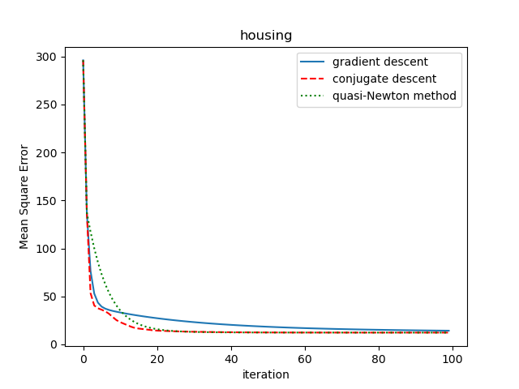
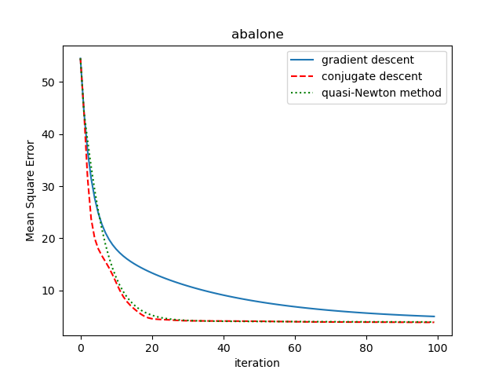
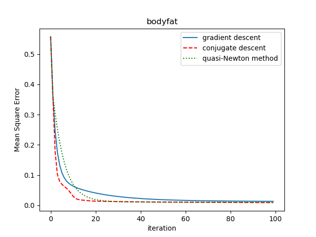

# Midterm homework for Introductory Lectures on Optimization

Question: Based on the small datasets abalone, bodyfat, and housing, training a ridge regressionmodel with algorithms Gradient Descent, Conjugate Descent, and quasi-Newton method respectively.  

Requirement: Implement algorithms (Gradient Descent, Conjugate Descent, and quasi-Newton method) using c/c++ programming language.  

Datasets can be downloaded from <https://www.csie.ntu.edu.tw/~cjlin/libsvmtools/datasets/regression.html>.

**result**

